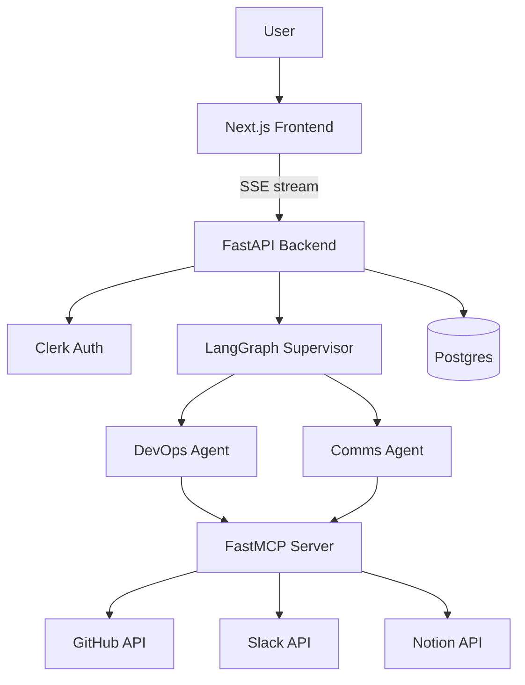

## Overview
  A Multi-Agent Project Management system with multimodal capabilities, which uses one of Groq's vision models(free tier). This system interacts with Github,Slack and Notion all
  in one place, enabling user to perform common workflows such as writing Github issues, posting Slack messages and updating Notion databases. Further, the user can obtain natural language 
  responses from llm that can read the content your github issues,slack messages and notion database, this app uses token-based authentication to connect these services with the agent

  What makes it useful is its agentic capability of execution of tasks and modification of data through structured tool calling and model context protocol. Building a simple custom 
  MCP server by integrating multiple services in a single place and converting them to "tools" enables LLM to actively interact with these services from just a single Web application
  

## Demo


[Watch the demo](<linkedin-post-url>)

## Features

- **Multi-agent architecture** — a supervisor agent routes requests to specialized sub-agents (GitHub operations, Slack/Notion communications)
- **Real tool integrations via MCP** — a custom FastMCP server exposing GitHub, Slack, and Notion as tools, resources, and prompts
- **Streaming chat UI** — real-time responses over SSE
- **Voice input & output** — speech-to-text and text-to-speech, hands-free interaction
- **Image understanding** — attach a screenshot, the agent interprets it and acts (e.g. file a bug report)
- **Authentication** — per-user accounts and isolated chat history via Clerk
- **Persistent memory** — conversations survive server restarts (Postgres-backed LangGraph checkpointing)
- **Chat history** — resume any past conversation

## Architecture



## Tech Stack

| Layer | Technology |
|---|---|
| Frontend | Next.js, TypeScript, Tailwind CSS |
| Backend | FastAPI, Python |
| Agent orchestration | LangGraph (multi-agent supervisor pattern) |
| Tool server | FastMCP (Model Context Protocol) |
| LLM | Groq (Llama models) |
| Auth | Clerk |
| Database | PostgreSQL (conversation persistence, chat history) |
| Integrations | GitHub API, Slack API, Notion API |

## Project Structure

```
support-ops-agent/
├── mcp-server/     # FastMCP server — GitHub/Slack/Notion tools, resources, prompts
├── agent/          # LangGraph multi-agent supervisor
├── backend/        # FastAPI gateway, SSE streaming, auth, chat history
├── frontend/       # Next.js chat UI
└── docs/           # Architecture notes and build progress log
```

## Getting Started

### Prerequisites
- Python 3.11+
- Node.js 18+
- Docker (for Postgres)
- Accounts/API keys: Groq, GitHub, Slack, Notion, Clerk

### 1. Clone and configure environment variables
```bash
git clone <your-repo-url>
cd support-ops-agent
cp .env.example .env   # fill in your API keys
```

### 2. Start Postgres
```bash
cd backend
docker compose up -d
```

### 3. Start the MCP server
```bash
cd mcp-server
python -m venv venv && source venv/bin/activate   # Windows: venv\Scripts\activate
pip install -r requirements.txt
python server.py
```

### 4. Start the backend
```bash
cd backend
python -m venv venv && source venv/bin/activate
pip install -r requirements.txt
uvicorn main:app --reload
```

### 5. Start the frontend
```bash
cd frontend
npm install
npm run dev
```

Visit `http://localhost:3000`.

## Known Limitations & Production Roadmap

This project is under active development toward a production-grade deployment. Current state:

- [x] Core multi-agent functionality
- [x] Authentication & per-user chat history
- [ ] Docker containerization
- [ ] CI/CD (GitHub Actions)
- [ ] Rate limiting & concurrent-user handling (Redis)
- [ ] Automated tests
- [ ] Live deployment
- [ ] Per-user OAuth (currently uses shared service credentials — see note below)

**Note on integrations**: this demo currently uses a single set of shared GitHub/Slack/Notion credentials (pointed at a single account) rather than per-user OAuth. Per-user OAuth is a planned future milestone.

## What I Learned / Challenges Solved

Other than environment related issues in vscode, such as the python interpretor, the langchain-mcp-adapters and mcp package versions conflicts etc, I encountered many issues and bugs, that i overcame and
consequently learned what to do and what not to do:
- In case of no items in Github,Slack or Notion, the tool returned an empty list [], which LLM treated as a failed/inconclusive response, assuming it needed to retry, which led to an infinite tool-calling loop. To fix this, I modified the tools to return an explicit dictionary with a descriptive message, for e.g {"status": "success", "count": 0, "message": "No open GitHub issues found in the repository."}
- agent was taking proactive escalation actions on read-only queries(e.g "list github issues" led to agent actually creating a new issue), to fix this I tightened system prompt to require explicit user intent or clear trigger match
- The multi-agent wrapper was returning child-agent results in a format Groq rejected for tool messages. This occured as the supervisor was receiving structured/complex content from delegated child agents instead of a plain text string
- Fix: normalized child-agent output to a simple string before returning it from the wrapper tool
-  Groq rate-limit / bad-request failures caused retry storms. Retries were firing immediately on provider errors, consuming quota faster. To fix this, I added explicit handling for rate-limit and bad-request errors, with graceful fallback responses instead of aggressive retry loops
- The model occasionally emitted malformed tool-call payloads, Groq requires strict payload schema which was corrupted due to nested tool calls. To mitigate this, I lowered temperature to `0.1` and kept tool-call delegation structured for more stable behavior.
- Nested sub-agent streams caused duplicated/interleaved output. To fix this, I switched from live token streaming to final-message-on-completion, since attributing tokens to the correct sub-agent mid-stream is unreliable with nested runs. Tool-call indicators still stream live, final answer renders as one clean markdown block once the run completes. Then, I added react-markdown + remark-gfm for proper formatting.
- Implemented a lightweight post-processing layer for speech transcripts to correct common Web Speech API misrecognitions such as "GitHub" → "get hub" and "Slack" → "slap". This normalization runs client-side before the prompt is sent to the agent, improving reliability for voice-driven workflows without adding heavy dependencies.


Just to add, I am still working on this project, fixing and enhancing its UI and more importantly, hardening the infrastructure layer to make it as production ready and error free as possible in $0.

## Connect

www.linkedin.com/in/mds970
